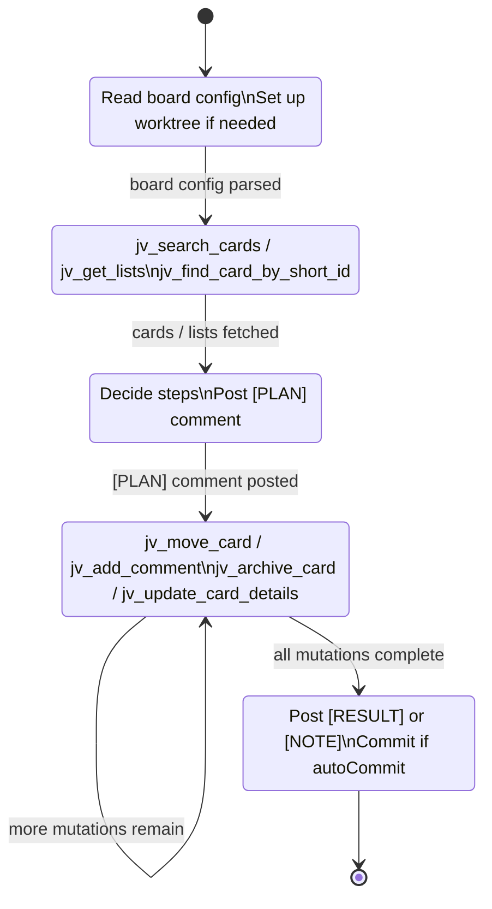
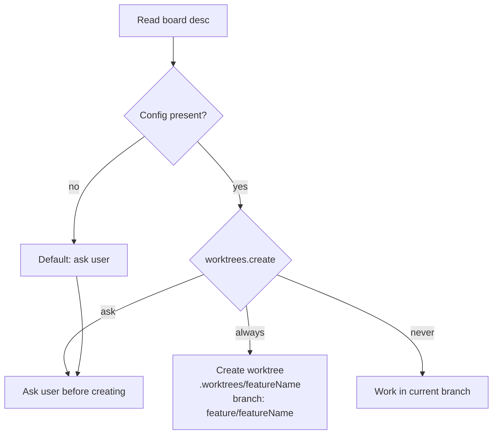
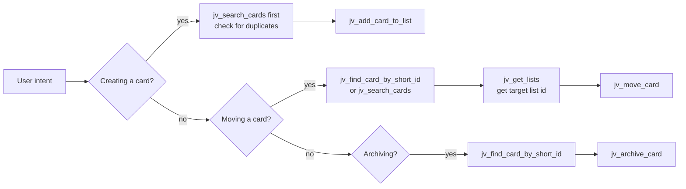

# Trello MCP Agent Skill

Use this skill whenever you are operating against the Trello MCP server to ensure you pick the right tool variant, leave structured comments, and keep token usage low.

---

## Agent state machine



---

## Session setup

### 1 — Read board config

At the start of every session call:

```json
{ "name": "jv_get_active_board_info", "arguments": {} }
```

Parse the `desc` field of the response. If it contains a JSON block matching the shape below, extract and apply it. If it is absent or malformed, fall back to defaults.

```js
{
  worktrees: {
    create: 'always',   // 'always' | 'ask' | 'never'  — default: 'ask'
    path: '.worktrees',
    format: `${path}/${featureName}`,
    branchFormat: `feature/${featureName}`
  },
  autoCommit: false,    // default: false
  createPr: false       // default: false
}
```

**Parsing rule:** look for the first `{` … `}` block in `desc` that contains the key `worktrees` or `autoCommit`. Strip JS comments (`//`) before parsing.

### 2 — Apply worktree config



`featureName` is a short slug derived from the card or task name being worked on (kebab-case, max 40 chars). Example: `fix-auth-bug`.

**Worktree command** (when `create: 'always'` or user says yes):

```bash
git worktree add .worktrees/featureName -b feature/featureName
```

One session = one worktree. Subagents never create new worktrees — they inherit the parent's `cwd`.

### 3 — Auto-commit and PR

| Config flag | Behaviour |
|---|---|
| `autoCommit: true` | Commit after each logical unit of work (card processed, comment added, etc.) |
| `autoCommit: false` | Never commit without explicit user instruction |
| `createPr: true` | Open a PR when all mutations for the session are done |
| `createPr: false` | Never open a PR without explicit user instruction |

---

## Comment discipline

Every non-trivial action on a card should leave a structured comment. Prefix every comment with a type tag:

| Tag | When to use |
|---|---|
| `[PLAN]` | Before starting work — what steps you will take and why |
| `[DECISION]` | At the moment you make a non-trivial judgment call |
| `[RESULT]` | The deliverable: what was done, what changed, output or answer |
| `[NOTE]` | Context that isn't a plan, decision, or result (worktree path, session info, admin notes) |
| `[QUESTION]` | User input needed — blocks progress |

**A non-trivial diff with zero `[DECISION]` comments is a process failure.**

### Comment format

```
[PLAN]
## Goal
{what we're solving and why}
## Steps
1. …
2. …
## Non-goals
{what we're explicitly NOT doing}
```

```
[DECISION] {one-line summary of the choice made and why}
```

```
[RESULT]
## Changes
- {what was moved / updated / created}
## Follow-ups
- {deferred items or questions for the user}
```

```
[NOTE] {free-form context, e.g. "Working in .worktrees/fix-auth-bug on feature/fix-auth-bug"}
```

```
[QUESTION] {what you need — be specific so the user can answer without asking a follow-up}
```

Post comments via:

```json
{ "name": "jv_add_comment", "arguments": { "cardId": "card-id", "text": "[PLAN]\n…" } }
```

`jv_add_comment` returns `{ id }` only. That is the confirmation — do not try to read the comment back.

---

## Tool selection guide

### Reading cards

| Goal | Tool | Notes |
|---|---|---|
| Resolve a short ID like `JVT-4` | `jv_find_card_by_short_id` | Fastest — single `/search` call |
| Search by name or text | `jv_search_cards` | Slim fields; no list fetch needed |
| Search by label | `jv_search_cards` with `query: "label:LABEL_NAME"` | e.g. `"label:AI_READY"` |
| Get my open cards | `jv_get_my_cards` | Defaults to open + slim fields |
| Quick lookup (no comments/checklists) | `jv_get_card` with `lightweight: true` | ~90% smaller payload |
| Full details (comments, checklists, attachments) | `jv_get_card` with `lightweight: false` | Use sparingly — large payload |

### Reading lists

`jv_get_lists` returns `id` and `name` only by default. Pass `fields` if you need more.

---

## Mutation response shapes

Every mutation returns a **minimal confirmation**. Never try to read updated card state from a mutation response — call `jv_get_card` if you need it.

| Tool | Returns |
|---|---|
| `jv_add_comment` | `{ id }` |
| `jv_move_card` | `{ id, idList }` |
| `jv_update_card_details` | `{ id }` |
| `jv_archive_card` | `{ id, closed: true }` |
| `jv_add_card_to_list` | `{ id, name, shortLink, url }` + `shortId` if `boardPrefix` was provided |
| `jv_list_boards` | `[{ id, name, closed }]` — identification fields only |
| `jv_get_lists` | `[{ id, name }]` by default |

---

## Tool ordering rules



**Hard rules:**
- Always `jv_search_cards` before `jv_add_card_to_list` — avoid duplicates
- Always resolve a card (`jv_find_card_by_short_id` or `jv_search_cards`) before `jv_move_card` or `jv_archive_card`
- Always `jv_get_lists` before `jv_move_card` unless you already have the target list ID cached in this session

---

## Short ID system

Cards can be given human-readable IDs like `JVT-4` at creation time. These are appended to the card name as `[JVT-4]` and are searchable.

### How the prefix registry works

The server maintains a `prefix → boardId` map in memory, persisted to `~/.trello-mcp/config.json`. It merges two sources at startup:

1. **`BOARD_PREFIXES` env var** (optional, for static bootstrap) — set once in your MCP JSON config
2. **Persisted registry** — written to disk whenever you call `jv_register_board_prefix` or `jv_setup_board_prefixes`

Env var values take precedence over the persisted file on conflict. Registered values survive restarts. **No server restart is needed** when you register a new prefix via a tool call.

### First-time setup (recommended flow)

```
1. jv_list_boards                    → get all board IDs + names
2. jv_setup_board_prefixes(mappings) → register chosen prefix for each board
3. jv_list_board_prefixes            → confirm the registry
```

Example `jv_setup_board_prefixes` call:

```json
{
  "name": "jv_setup_board_prefixes",
  "arguments": {
    "mappings": [
      { "prefix": "JVT", "boardId": "boardId1" },
      { "prefix": "TATA", "boardId": "boardId2" }
    ]
  }
}
```

Prefixes are always stored as uppercase (`jvt` → `JVT`).

### Adding a new board later

```json
{ "name": "jv_register_board_prefix", "arguments": { "prefix": "PROJ", "boardId": "boardId3" } }
```

Takes effect immediately. No restart required.

### Checking current registry

```json
{ "name": "jv_list_board_prefixes", "arguments": {} }
```

### Creating a card with a short ID

```json
{
  "name": "jv_add_card_to_list",
  "arguments": { "listId": "your-list-id", "name": "Fix auth bug", "boardPrefix": "JVT" }
}
```

Response: `{ id, name: "Fix auth bug [JVT-42]", shortLink, url, shortId: "JVT-42" }`.

The prefix does **not** need to be in the registry for card creation — it's used as-is. The registry is only needed for `jv_find_card_by_short_id` auto-resolve.

### Resolving a short ID

```json
{ "name": "jv_find_card_by_short_id", "arguments": { "shortId": "JVT-42" } }
```

`boardId` is auto-resolved from the registry by extracting the prefix. If the prefix isn't registered, the search falls back to all boards — slower but still works.

---

## Efficient workflow patterns

### Triage: find and move a card

```
1. jv_find_card_by_short_id("JVT-4")   → card.id + card.idList
2. jv_get_lists()                       → target list id
3. jv_add_comment(card.id, "[PLAN]…")   → confirm plan
4. jv_move_card(card.id, listId)        → { id, idList }
5. jv_add_comment(card.id, "[RESULT]…") → confirm result
```

### Bulk comment loop

Call `jv_add_comment` per card. Each call costs ~200 tokens in + ~20 tokens out (returns `{ id }` only). At 300 req/10s the bottleneck is the API rate limit, not the payload.

### Searching by label

```json
{
  "name": "jv_search_cards",
  "arguments": { "query": "label:AI_READY", "boardIds": ["your-board-id"], "limit": 20 }
}
```

### jv_get_my_cards params

```json
{
  "name": "jv_get_my_cards",
  "arguments": { "filter": "open", "fields": "name,idShort,idBoard,idList,labels,due,dueComplete" }
}
```

`filter` options: `open` (default), `closed`, `all`, `visible`, `none`.
